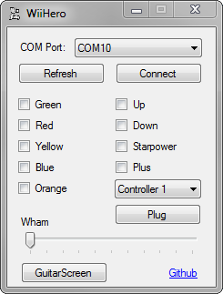
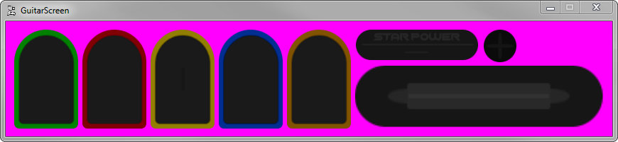
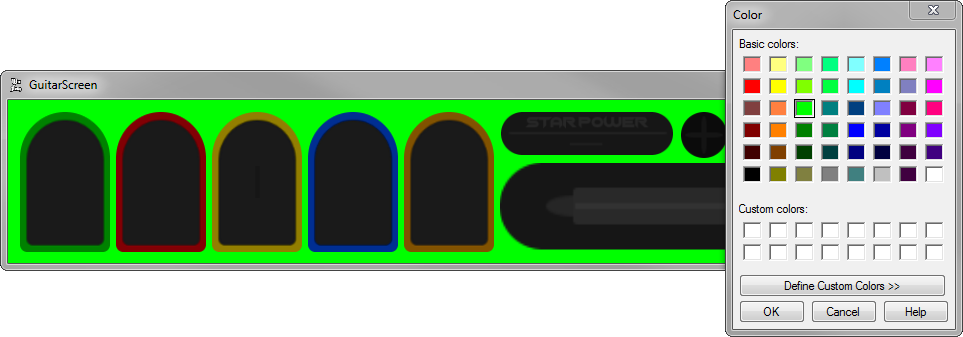
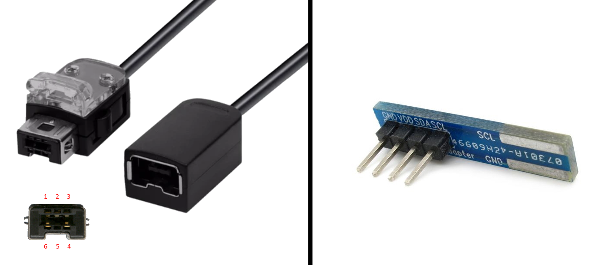
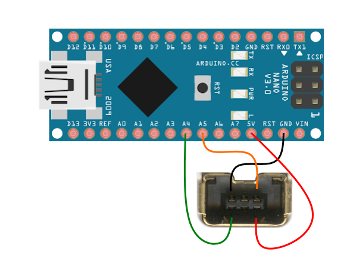
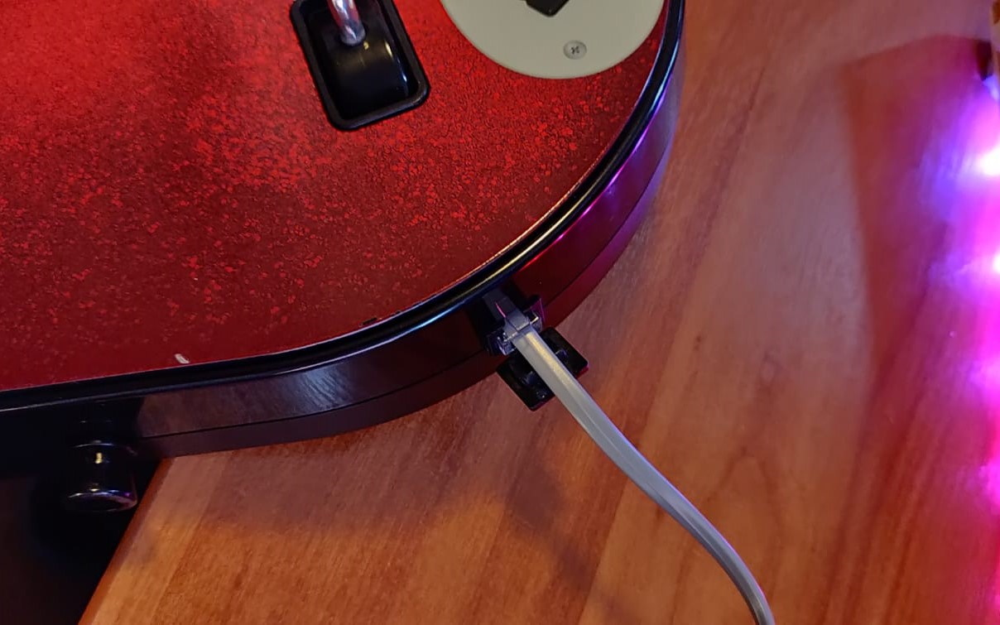
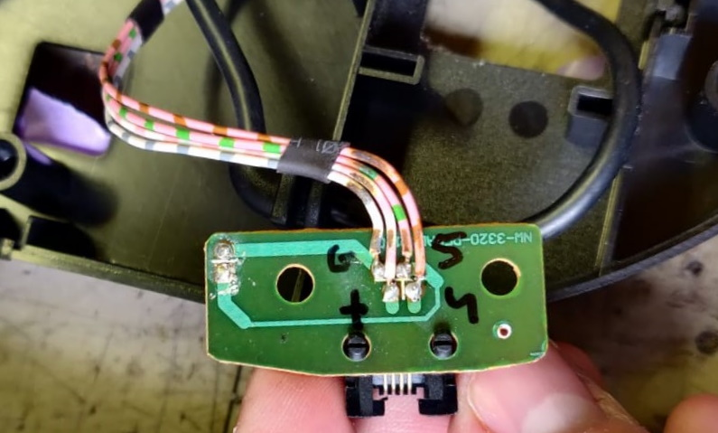
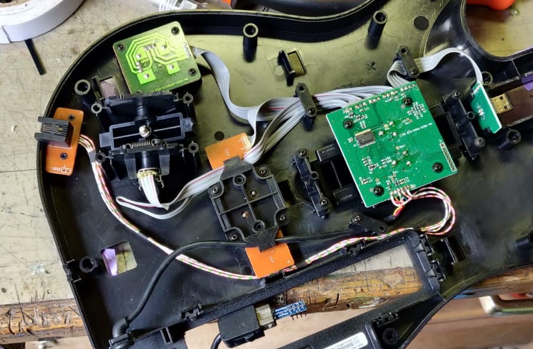
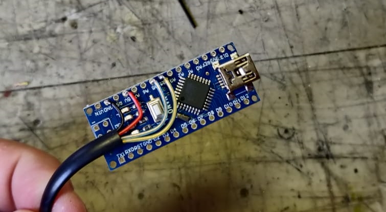
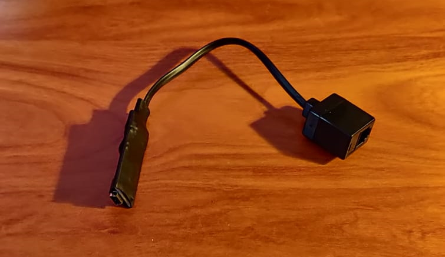

WiiHero is a project that allows you to use your **Nintendo Wii guitar** on your PC. By using an **Arduino** as a proxy and a C# project we emulate an **XBOX 360 controller** to Windows.

### How to play
To prepare, you have to follow these steps:

* Install the [WiiChuck](https://github.com/madhephaestus/WiiChuck) Arduino library.
* Upload the Arduino sketch.
* Install the XBOX 360 driver **ScpDriverInstaller.exe**. (This only has to be done once.)

Now we can run WiiHero. Follow these steps:

* Select the proper COM port from the list.
* Press connect.
* Select which controller you want to play on. (For multiple players, Controller 1 is default)
* Press "Plug" to plug-in the virtual controller.

The Arduino and guitar need a so called "handshake" to function. This handshake only runs on the startup of the Arduino. This means that when the Arduino and guitar have been disconnected, you need to reset the Arduino. You can do this by either un-and re-plugging it or pressing the reset button on the Arduino board.

#### Default mapping
By default the keys are mapped like this:

|Guitar		|Controller		|
|-----------|---------------|
|Green		|A				|
|Red		|B				|
|Yellow		|Y				|
|Blue		|X				|
|Orange		|Left Shoulder	|
|Starpower	|Start			|
|Plus		|Back			|
|Strum Up	|DPad Up		|
|Strum Down	|DPad Down		|
|Whammy Bar	|Right Stick X	|

### GuitarScreen
The guitarscreen is an option made for content creators.
Button presses will show up here, which can be chroma keyed in (for example) OBS.

Pressing the background will show a colorpicker which allows you to change the background color if you prefer so.

### Hardware
For this project to work, you will have to do some electronics. You have to connect your guitar to an Arduino. I recommend using an Arduino Nano because of its small footprint and USB connection.. You will also need either a **Nintendo Classic extension cable** which you are willing to sacrifice, or an **Arduino Nunchuck Connector**. Both will be easy to find for purchase online.

The premade Arduino Nunchuck connector has its pinout written on the board but doesn't provide the strongest connection. Therefore I prefer to cut up an extension cable. For this approach, you will need this wiring:

Now upload the Arduino sketch provided in the repo and the hardware is done.

### How does it work?

#### Arduino side
A Wii guitar (or any wii peripheral for that matter) uses a so called I²C-bus to communicate with the WiiMote. This is a standard protcol which an Arduino can understand.

By using the WiiChuck library we are able to initialize a connection to the guitar without much effort. The library has the capability to convert data from the guitar into a list of integers we can use.

By converting that list into a string and sending it over the serial communication bus, we have succesfully sent the data from the guitar over to your PC.

#### PC Side
With a very basic C# program we can read the strings sent over by the Arduino. The string is made up of comma seperated integers, which are being split up again at the PC side.

With the [SimWinInput](https://github.com/DavidRieman/SimWinInput) NuGet package we are able to emulate an XBOX 360 controller which we can sue to play games. It requires you install its own driver though. Make sure you don't forget to do this.

The program will check which buttons are pressed, and it will send them over to the virtual controller.

We now have the ability to map the buttons in any game we want.

### Pictures
The first iteration of this project makes use of the unused RJ11 port on the side of the guitar. By modifying the wiring inside, I used its 4 pins to transfer over the power and datalines. I used an Arduino Nano, an RJ11 phonecable extension cord and some heatshrink tubing to make it into a very small and usable device.

